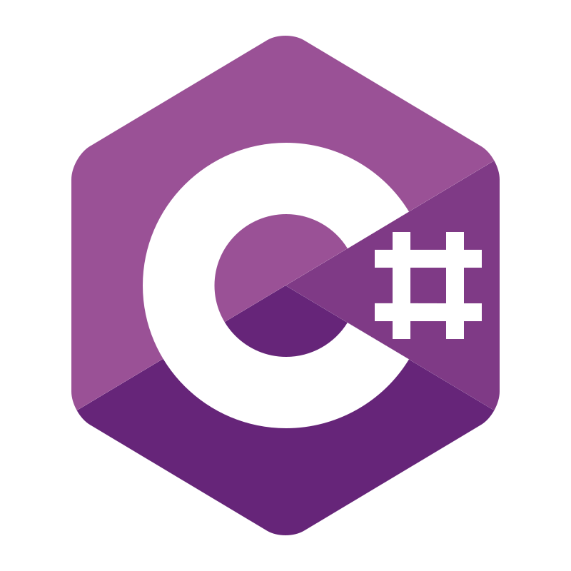

<!-- 

  Visitor count 
  

 -->

<h1 align="center">Waddup 🎏</h1>
<h3 align="center">I'm Patrik, a student and an airsofter from the Czech Republic :D</h3>

<h1>
 
</h1>

<h3 align="left">Languages and Tools:</h3>

         

<h3 align="left">Stats:</h3>

### 🎧 Spotify Playing

